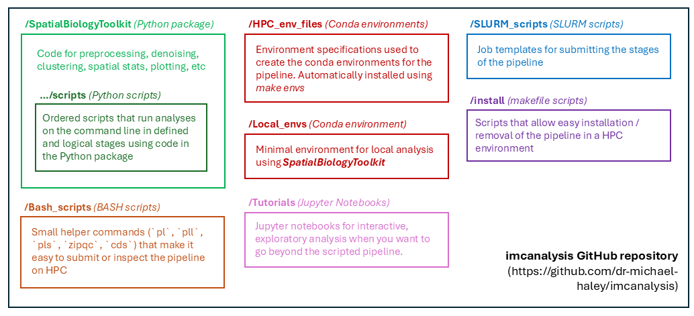
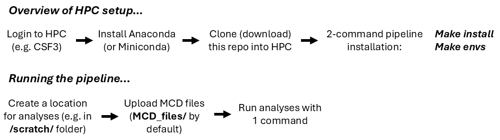
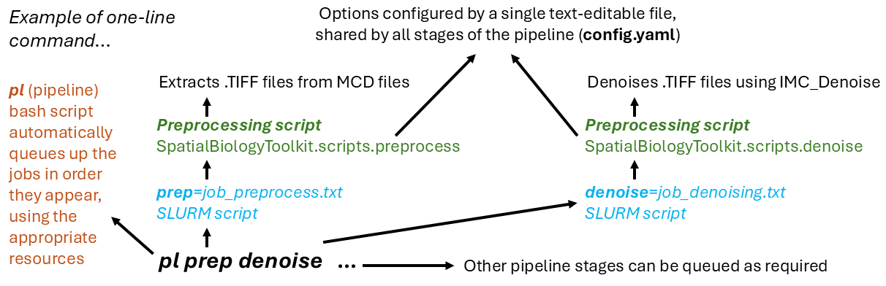

# imcanalysis

> [!IMPORTANT]
> **DISCLAIMER** I plan to add releases and tests in the future, but for now everything is provided “as is” with no guarantees.
> I’ll do my best to respond to issues (see Reporting issues), but I’m a single developer and actively use this code in my own projects, so response times can vary.
> Feedback and suggestions to improve any aspect of the repo are welcome and encouraged! If anything isn't clear then feel free to let me know.

Toolkit for analysing Imaging Mass Cytometry (IMC) and other spatial-omics data. It combines a Python package (`SpatialBiologyToolkit`), CLI pipeline stages, SLURM job templates, tutorials, and HPC helper scripts.

## Start here

**Completely new to the command line / Python tooling?** Start with [README_NEW_USERS.md](README_NEW_USERS.md), which goes through the absolute basics.

**Recommended workflow:** this project is **HPC-first**. The majority of analyses are easiest to run on an HPC cluster via the scripted pipeline (headless SLURM jobs), taking you from raw data (i.e. a folder with MCD files) through standard preprocessing and analysis steps with minimal manual intervention. Afterwards, a smaller minority of work is typically done locally in notebooks for bespoke exploration and figures. Start with [README_IMC_HPC.md](README_IMC_HPC.md) plus [SLURM_scripts/README.md](SLURM_scripts/README.md). 

**Local notebooks (usually after HPC):** use [README_LOCAL.md](README_LOCAL.md) and [Tutorials/README.md](Tutorials/README.md).

**Legacy material:** older or experimental code exists in [External_and_old_code/README.md](External_and_old_code/README.md). These are not tightly maintained and are best suited for advanced users who are comfortable troubleshooting.

## Quick setup (advanced: local workstation, using SpatialBiologyToolkit in your own analysis)

This is a quick-start for advanced users who simply want to import and use the `SpatialBiologyToolkit` Python code in their own local scripts/notebooks (i.e. not running the full HPC pipeline).

For full details, follow [README_LOCAL.md](README_LOCAL.md). The shortest version is:

1. Create the conda env: `conda env create -f Local_envs/sbt_env.yml`.
2. Activate: `conda activate sbt`.
3. Install the package editable (from the repo root): `pip install -e .`.
4. Copy `Tutorials/` to an analysis folder outside the repo, then run `jupyter lab` from that analysis folder.

## Components of repository
- [SpatialBiologyToolkit/](SpatialBiologyToolkit/README.md): the core Python package where the analysis logic lives (preprocessing, denoising, clustering, spatial stats, plotting). If you import anything in Python, it usually comes from here.
- [SpatialBiologyToolkit/scripts/](SpatialBiologyToolkit/scripts/README.md): command-line “pipeline stages” that run the core steps in order. These read `config.yaml` from your dataset folder and are what the SLURM jobs call.
- [SLURM_scripts/](SLURM_scripts/README.md): job templates for running stages on HPC. The `pipeline.conf` file maps short names (like `preprocess`) to these scripts.
- [Bash_scripts/](Bash_scripts/README.md): small helper commands (`pl`, `pll`, `pls`, `zipqc`, `cds`) that make it easy to submit or inspect the pipeline on HPC.
- [Tutorials/](Tutorials/README.md): Jupyter notebooks for interactive, exploratory analysis when you want to go beyond the scripted pipeline.
- [install/](install/README.md): install/uninstall helpers used by `make install` (sets PATH, config file, and permissions on HPC).
- [Local_envs/](Local_envs/): minimal environment for _local_ analysis using SpatialBiologyToolkit.
- [HPC_env_files/](HPC_env_files/): environment specifications used to create the conda environments for the pipeline. Automatically installed using `make envs`
- [docs/](docs/README.md): documentation sources (Sphinx); the built HTML is in `Documentation/`.
- [External_and_old_code/](External_and_old_code/README.md): legacy or experimental code and notebooks. Useful for advanced users, but not tightly maintained.

## Reporting issues
Please use GitHub Issues for bugs and questions. Include:
- the pipeline stage or notebook name
- the environment file used (e.g. `Local_envs/sbt_env.yml` or `HPC_env_files/...`)
- any overrides in `config.yaml`
- a short log/traceback snippet if available

If you’re unsure whether something is a bug or a usage question, open an issue anyway and tag it as a question.