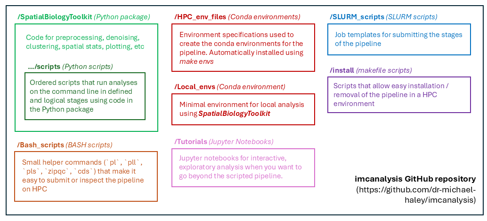

> [!IMPORTANT]
> This project is actively developed and provided as-is. Bug reports,
> questions, and suggestions are welcome through GitHub Issues.

# SpatialBiologyToolkit / imcanalysis

SpatialBiologyToolkit analyses imaging mass cytometry and other spatial-omics
data. The repository combines a Python package, config-driven command-line
stages, SLURM wrappers, tutorials, and HPC installation helpers.

**The complete documentation is published at
[imcanalysis.readthedocs.io](https://imcanalysis.readthedocs.io/en/latest/).**



## Start here

- If the command line, conda, or Jupyter are new to you, read the [new-user guide](https://imcanalysis.readthedocs.io/en/latest/getting_started/beginners.html).
- For the recommended HPC-first workflow, use the [HPC setup](https://imcanalysis.readthedocs.io/en/latest/getting_started/hpc.html), [`sbt` CLI guide](https://imcanalysis.readthedocs.io/en/latest/pipeline/cli.html), [pipeline workflow](https://imcanalysis.readthedocs.io/en/latest/pipeline/workflow.html), and [outputs/reporting guide](https://imcanalysis.readthedocs.io/en/latest/pipeline/reporting.html).
- For notebooks and interactive exploration, use the [local setup](https://imcanalysis.readthedocs.io/en/latest/getting_started/local.html) and [tutorial index](https://imcanalysis.readthedocs.io/en/latest/tutorials/index.html).
- For exact stage and config fields, use the generated [SLURM stage reference](https://imcanalysis.readthedocs.io/en/latest/pipeline/stages/index.html) and [configuration reference](https://imcanalysis.readthedocs.io/en/latest/reference/configuration/index.html).

The usual pattern is to run compute-heavy, repeatable processing on HPC and
then copy the AnnData and selected images into a separate local analysis folder
for interactive work.

## Quick local setup

For experienced conda users:

```bash
conda env create -f Local_envs/sbt_env.yml
conda activate sbt
pip install -e .
```

Copy any notebooks you plan to edit out of `Tutorials/` and into your own
analysis directory before starting Jupyter.

## Repository map

- `SpatialBiologyToolkit/`: reusable Python analysis package.
- `SpatialBiologyToolkit/cli/` and `SpatialBiologyToolkit/pipeline/`: lightweight project, planning, SLURM submission, status, and log control layers.
- `SpatialBiologyToolkit/reporting/`: typed stage manifests, report lifecycle, file inventories, Markdown reports, and project/stage indexes.
- `SpatialBiologyToolkit/scripts/`: config-driven pipeline entry points.
- `SLURM_scripts/`: registered job wrappers; `pipeline.conf` remains a legacy mirror of the Python stage registry.
- `Bash_scripts/`: legacy `pl`, `pll`, `pls`, plus `zipqc`, `cds`, and other HPC helpers.
- `Tutorials/`: current and archived Jupyter notebooks.
- `Local_envs/` and `HPC_env_files/`: local and pipeline environment definitions.
- `docs/`: canonical Sphinx sources and generated reference tooling.
- `External_and_old_code/`: unsupported historical/experimental material.

The README files that used to duplicate these topics now point into the
canonical Sphinx documentation, so changes should be made under `docs/source/`.

## Reporting issues

Please include the pipeline stage or notebook, environment definition, relevant
`config.yaml` overrides, and a short traceback or log excerpt. If you are unsure
whether something is a bug or a usage question, open an issue anyway.
