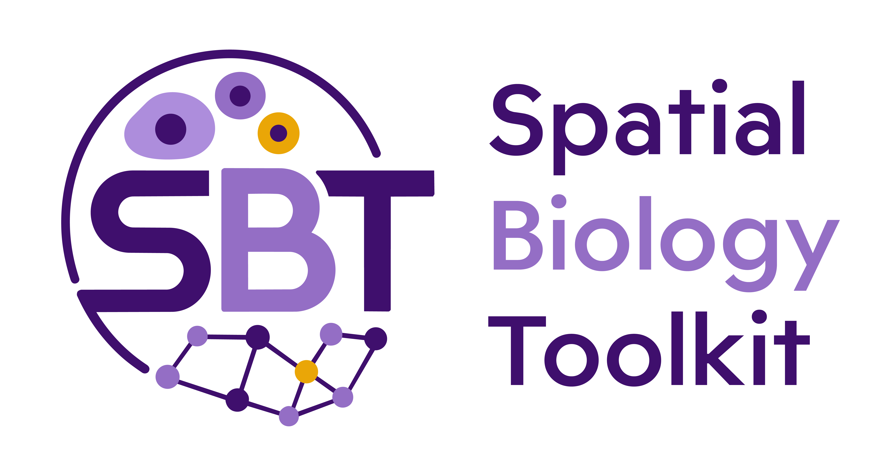
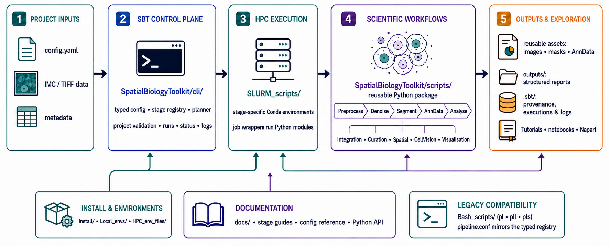

<p align="center">
  <a href="https://imcanalysis.readthedocs.io/en/latest/">
    
  </a>
</p>

<p align="center">
  A config-driven toolkit for imaging mass cytometry and spatial-biology analysis.
</p>

<p align="center">
  <a href="https://imcanalysis.readthedocs.io/en/latest/">Documentation</a> ·
  <a href="https://imcanalysis.readthedocs.io/en/latest/stages/index.html">Scientific guides</a> ·
  <a href="https://imcanalysis.readthedocs.io/en/latest/pipeline/cli.html"><code>sbt</code> CLI</a> ·
  <a href="https://imcanalysis.readthedocs.io/en/latest/tutorials/index.html">Tutorials</a>
</p>

> [!IMPORTANT]
> This project is actively developed and provided as-is. Bug reports,
> questions, and suggestions are welcome through GitHub Issues.

## What is SpatialBiologyToolkit?

SpatialBiologyToolkit (repository name: `imcanalysis`) analyses imaging mass
cytometry and other spatial-biology data. It combines a reusable Python
package with typed configuration, a project-aware `sbt` command-line interface,
SLURM pipeline stages, structured reports, interactive tools, tutorials, and
biologist-oriented explanations of the science behind each processing stage.

The end-to-end, compute-heavy workflow is designed primarily for Linux HPC
systems running SLURM. Local environments support downstream analysis and
notebook work on Windows and macOS.



## Start here

- If the command line, conda, or Jupyter are new to you, read the [new-user guide](https://imcanalysis.readthedocs.io/en/latest/getting_started/beginners.html).
- To understand what a stage does, why it is performed, and how to interpret its biological outputs, use the [scientific guides](https://imcanalysis.readthedocs.io/en/latest/stages/index.html).
- For the recommended HPC-first workflow, use the [HPC setup](https://imcanalysis.readthedocs.io/en/latest/getting_started/hpc.html), [`sbt` CLI guide](https://imcanalysis.readthedocs.io/en/latest/pipeline/cli.html), [pipeline workflow](https://imcanalysis.readthedocs.io/en/latest/pipeline/workflow.html), and [outputs/reporting guide](https://imcanalysis.readthedocs.io/en/latest/pipeline/reporting.html).
- For notebooks and interactive exploration, use the [local setup](https://imcanalysis.readthedocs.io/en/latest/getting_started/local.html) and [tutorial index](https://imcanalysis.readthedocs.io/en/latest/tutorials/index.html).
- For exact stage and config fields, use the generated [SLURM stage reference](https://imcanalysis.readthedocs.io/en/latest/pipeline/stages/index.html) and [configuration reference](https://imcanalysis.readthedocs.io/en/latest/reference/configuration/index.html).

The usual pattern is to run compute-heavy, repeatable processing on HPC and
then copy the AnnData and selected images into a separate local analysis folder
for interactive work.

## Choose your setup

| Use case | Platform | Starting point |
| --- | --- | --- |
| Reproducible end-to-end pipeline | Linux HPC with SLURM | [HPC setup](https://imcanalysis.readthedocs.io/en/latest/getting_started/hpc.html) |
| Local analysis and notebooks | Windows | `Local_envs/sbt_env.yml` |
| Local analysis and notebooks | macOS | `Local_envs/sbt_env_macos.yml` |

The portable macOS environment has been solver-verified for Apple Silicon and
contains no architecture-specific pins. Intel macOS is expected to work but
has not yet been solver-verified. It intentionally omits CUDA, Windows runtime
packages, and several less-portable optional components; see the
[local setup guide](https://imcanalysis.readthedocs.io/en/latest/getting_started/local.html)
for the current compatibility details.

Experienced conda users can create a local environment from the repository
root:

```bash
# Windows
conda env create -f Local_envs/sbt_env.yml

# macOS
conda env create -f Local_envs/sbt_env_macos.yml

conda activate sbt
pip install -e .
```

Copy any notebooks you plan to edit out of `Tutorials/` and into your own
analysis directory before starting Jupyter.

## Pipeline at a glance

The lightweight `sbt` interface validates projects and configuration, plans
dependencies, submits the existing SLURM wrappers, and records stage status,
logs, outputs, and provenance. For example:

```bash
sbt project adopt --config config.yaml
sbt plan segmentation
sbt run segmentation --dry-run
sbt summary
```

Use `sbt project init` for a new project, or follow the complete
[`sbt` CLI guide](https://imcanalysis.readthedocs.io/en/latest/pipeline/cli.html)
before submitting a real run.

## Repository map

- `SpatialBiologyToolkit/`: reusable analysis package, typed configuration, CLI, scientific stages, and reporting code.
- `SpatialBiologyToolkit/cli/` and `SpatialBiologyToolkit/pipeline/`: lightweight project, planning, SLURM submission, status, and log control layers.
- `SpatialBiologyToolkit/reporting/`: typed stage manifests, report lifecycle, file inventories, Markdown reports, and project/stage indexes.
- `SpatialBiologyToolkit/scripts/`: config-driven pipeline entry points.
- `SLURM_scripts/`: registered job wrappers; `pipeline.conf` remains a legacy mirror of the Python stage registry.
- `Bash_scripts/`: legacy `pl`, `pll`, `pls`, plus `zipqc`, `cds`, and other HPC helpers.
- `Tutorials/`: current and archived Jupyter notebooks.
- `Local_envs/`: launcher plus Windows and portable macOS local environment definitions.
- `HPC_env_files/`: fixed pipeline environment definitions used by registered stages.
- `install/`: HPC launcher, shell integration, environment, and uninstall helpers.
- `docs/`: canonical Sphinx sources and generated reference tooling.
- `tests/`: automated tests for the CLI, configuration, reporting, and scientific utilities.
- `External_and_old_code/`: unsupported historical/experimental material.

The README files that used to duplicate these topics now point into the
canonical Sphinx documentation, so changes should be made under `docs/source/`.

## Reporting issues

Please include the pipeline stage or notebook, environment definition, relevant
`config.yaml` overrides, and a short traceback or log excerpt. If you are unsure
whether something is a bug or a usage question, open an issue anyway.
