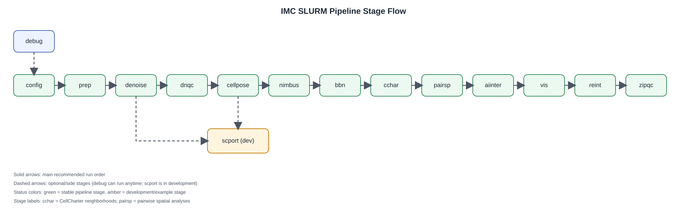

# SLURM pipeline stages

SLURM wrappers for the IMC pipeline (tested on CSF3). Each stage runs from a dataset working directory (the folder containing `config.yaml`) and calls one or more Python entrypoints in `SpatialBiologyToolkit/scripts`.

## Stage aliases (`pipeline.conf`)

| Alias | Job script |
|---|---|
| `prep` | `job_preprocess.sh` |
| `denoise` | `job_denoising.sh` |
| `dnqc` | `job_denoising_qc.sh` |
| `cellpose` | `job_cellposesam.sh` |
| `nimbus` | `job_nimbus.sh` |
| `bbn` | `job_biobatchnet.sh` |
| `cchar` | `job_cellcharter.sh` |
| `aiinter` | `job_ai.sh` |
| `vis` | `job_visualisations.sh` |
| `reint` | `job_reintegrate.sh` |
| `scport` | `job_scport.sh` |
| `zipqc` | `job_zipqc.sh` |
| `config` | `job_config.sh` |
| `debug` | `job_debug.sh` |

## Pipeline stage flow



## Default path conventions (from `GeneralConfig`)

These are used unless overridden in `config.yaml`:

| Key | Default |
|---|---|
| `general.imc_files_folder` | `IMC_files` |
| `general.metadata_folder` | `metadata` |
| `general.raw_images_folder` | `tiffs` |
| `general.denoised_images_folder` | `processed` |
| `general.masks_folder` | `masks` |
| `general.celltable_folder` | `cell_tables` |
| `general.qc_folder` | `QC` |

## Stage reference <span style="color:#2e7d32;">🟢</span> <span style="color:#b26a00;">🟡</span> <span style="color:#b71c1c;">🔴</span>

Traffic light status key:

- <span style="color:#2e7d32;">`🟢 GREEN`</span>: expected production pipeline stage.
- <span style="color:#b26a00;">`🟡 AMBER`</span>: in development / example stage; interface may change.
- <span style="color:#b71c1c;">`🔴 RED`</span>: do not use for production (none currently).

| Alias | Status | What it does | Conda env(s) used by SLURM job | Primary inputs | Primary outputs | Config blocks in `config.yaml` | Typical position |
|---|---|---|---|---|---|---|---|
| `config` | `🟢` | Runs `SpatialBiologyToolkit.scripts.update_config` to sync `config.yaml` with current dataclass defaults. Adds missing keys and removes obsolete sections/keys. | `${IMC_ENV_SEGMENTATION:-imc_segmentation}` | `config.yaml` (or creates one if missing). | Updated `config.yaml` (no backup unless script is run with `--backup`, which this job does not pass). | `general`, `preprocess`, `denoising`, `createmasks`, `segmentation`, `nimbus`, `process`, `visualization`, `cellcharter`, `logging` (sync/refresh) | Optional preflight before any compute-heavy stage. |
| `prep` | `🟢` | Runs `SpatialBiologyToolkit.scripts.preprocess` to import IMC files (`.mcd`/`.txt`), export stacks, unstack channels, and build metadata/panel tables. | `${IMC_ENV_SEGMENTATION:-imc_segmentation}` | IMC source files in `general.imc_files_folder` (default `IMC_files/`; legacy fallback `MCD_files/`). | `tiff_stacks/`, `tiffs/` ROI folders, `metadata/metadata.csv`, `metadata/dictionary.csv`, `metadata/panel.csv` (or `panel_*.csv` + `panel_mapping.csv` if multiple unique panels). | `general`, `preprocess`, `logging` | First core stage. |
| `denoise` | `🟢` | Runs `SpatialBiologyToolkit.scripts.denoising` (DeepSNF/DIMR flow) on channel TIFFs. Also supports outlier clipping and optional parameter scans via config. | `${IMC_ENV_DENOISE:-imc_denoise}` | `tiffs/` raw channels, `metadata/panel.csv`, denoising config block. | `processed/` denoised ROI/channel TIFFs, `QC/denoised_pixel_qc.csv` (or scan-suffixed variants), optional `QC/denoising/*.png`. | `general`, `denoising`, `logging` | After `prep`. |
| `dnqc` | `🟢` | Runs two checks: (1) `SpatialBiologyToolkit.scripts.denoising_qc` side-by-side raw vs denoised QC images, then (2) `SpatialBiologyToolkit.scripts.check_panel_consistency` for panel/image consistency + pixel QC stats. | `${IMC_ENV_DENOISE:-imc_denoise}` then `${IMC_ENV_SEGMENTATION:-imc_segmentation}` | `tiffs/`, `processed/`, `metadata/panel.csv`, `config.yaml`. | `QC/denoising/` images; panel consistency CSV reports (timestamped `panel_consistency_report_*.csv`, plus optional `_pixel_qc.csv`). | `general`, `denoising`, `logging` (plus `check_panel_consistency` defaults) | Recommended QC checkpoint immediately after `denoise`. |
| `cellpose` | `🟢` | Two-step mask workflow: first `SpatialBiologyToolkit.scripts.preprocess_dna` (DNA channel pre-processing), then `SpatialBiologyToolkit.scripts.cellpose_sam` (CellPose-SAM segmentation and mask QC). | `${IMC_ENV_SEGMENTATION:-imc_segmentation}` then `${IMC_ENV_CELLPOSESAM:-imc_cellposesam}` | `processed/` ROI folders, DNA channel defined by `createmasks.dna_image_name` (default `DNA1`), mask params from `createmasks`. | `preprocessed_dna/*.tiff`, `masks/*.tiff`, `QC/DNA_preprocessing_QC/`, `QC/CellposeSAM_QC/` and per-run CSV summaries. | `general`, `createmasks`, `logging` | After `denoise`; before `nimbus`. |
| `nimbus` | `🟢` | Runs `SpatialBiologyToolkit.scripts.segmentation_nimbus`: aligns masks + image channels, computes cell-level intensities/tables, performs Nimbus normalization/prediction, and builds AnnData. | `${IMC_ENV_SEGMENTATION:-imc_segmentation}` | `masks/`, `metadata/panel.csv`, `metadata/metadata.csv`, `processed/` (or raw fallback), segmentation/nimbus config. | `nimbus_output/` master tables + normalization files, `cell_tables/nimbus_cell_tables/` ROI tables, `anndata.h5ad`, optional `anndata_removed.h5ad`, `QC/nimbus_normalization_qc/`. | `general`, `segmentation`, `nimbus`, `logging` | Core segmentation-to-AnnData stage; run after masks exist. |
| `bbn` | `🟢` | Runs `SpatialBiologyToolkit.scripts.basic_process_biobatchnet`: BioBatchNet batch correction, neighbors/UMAP/Leiden, saves processed AnnData and QC UMAPs. | `${IMC_ENV_BIOBATCHNET:-imc_biobatchnet}` | `anndata.h5ad` (default `process.input_adata_path`), valid `process.batch_correction_obs` in `adata.obs`. | `anndata_processed.h5ad` (or scan-suffixed variants), `QC/BioBatchNet/` UMAPs + scan summary CSV. | `general`, `process`, `logging` | After `nimbus`; before `cchar`/`aiinter`/`vis`. |
| `cchar` | `🟢` | Runs `SpatialBiologyToolkit.scripts.cellcharter_neighborhoods`: computes TRVAE latent embeddings by default (`cc.tl.TRVAE`), builds spatial neighbor graphs per ROI, aggregates neighborhood features, clusters cells into spatial neighborhoods, and optionally computes enrichment against a label column. | `${IMC_ENV_CELLCHARTER:-imc_cellcharter}` | AnnData from `cellcharter.input_adata_path` or fallback (`process.output_adata_path` then `process.input_adata_path`), ROI/sample key, and XY coordinates (`obsm['spatial']` or `X_loc`/`Y_loc`). | `cellcharter.output_adata_path` (default `anndata_cellcharter.h5ad`) plus `QC/CellCharter_QC/` tables and spatial plots. | `general`, `process`, `cellcharter`, `logging` | Optional spatial neighborhood stage, typically after `bbn` (or after `aiinter` if enrichment should use AI cell-type labels). |
| `aiinter` | `🟢` | Runs `SpatialBiologyToolkit.scripts.ai_interpretation`: summarizes Leiden clusters and asks OpenAI model for cell-type labels, then writes `*_AIlabel` columns back into AnnData. | `${IMC_ENV_SEGMENTATION:-imc_segmentation}` | `anndata_processed.h5ad` with Leiden columns, `OPENAI_API_KEY`, visualization AI settings in config. | Updated `anndata_processed.h5ad`, `QC/AI_Interpretation/` prompt/raw JSON/TSV outputs. | `general`, `visualization`, `process`, `logging` | Optional, typically after `bbn` and before final visualization. |
| `vis` | `🟢` | Runs `SpatialBiologyToolkit.scripts.basic_visualizations`: UMAPs, matrix plots, tissue overlays, metadata-vs-population analysis, color legends, optional backgating outputs. | `${IMC_ENV_SEGMENTATION:-imc_segmentation}` | Processed AnnData (`anndata_processed.h5ad`), `masks/`, image folders, metadata files (`dictionary.csv` etc.). | `QC/BasicProcess_QC/` (UMAPs, matrix plots, overlays, population analysis tables/figures, legends, optional backgating outputs). | `general`, `visualization`, `process`, `logging` | Final analysis reporting stage. |
| `reint` | `🟢` | Runs `SpatialBiologyToolkit.scripts.reintegrate_markers`: merges removed markers back from `anndata_removed.h5ad` into the processed AnnData (including layers). | `${IMC_ENV_SEGMENTATION:-imc_segmentation}` | `anndata_processed.h5ad`, `anndata_removed.h5ad` (path from `segmentation.removed_markers_anndata_path`). | Overwrites/updates `anndata_processed.h5ad` with reintegrated marker variables/layers. | `general`, `segmentation`, `process`, `logging` | Optional post-processing, usually near the end. |
| `scport` | `🟡` | Runs external scPortrait conversion script (`~/scPortrait_to_IMC/imc_to_single_cells.py`) to generate single-cell portrait outputs from denoised images + masks. | `${IMC_ENV_SCPORTRAIT:-scPortrait}` | `processed/`, `masks/`. | `scPortrait/` project outputs (as defined by external script). | none | Optional branch after masks + denoised channels are available. |
| `zipqc` | `🟢` | Calls helper command `zipqc` (from `Bash_scripts/zipqc`) to package selected QC folders into a dated archive. | No conda activation in job script. | QC directories matching selected set (default set includes major `QC/BasicProcess_QC/*`, `QC/denoising/`, `QC/nimbus_normalization_qc/channel_galleries/`). | `<current_dataset_folder>_default_<YYYY-MM-DD>.zip` (or other set suffix if passed manually). | none | Optional final packaging step. |
| `debug` | `🟢` | Environment/entrypoint diagnostic runner. Iterates job scripts, activates each declared `#@ENV`, imports declared `#@MODULE`, checks Python/libstdc++ runtime, and tests extra imports from `env_imports.yaml`. | Uses whatever env each job declares via `#@ENV`. | `SLURM_scripts/*.sh` metadata + `env_imports.yaml`. | SLURM log output (`imc_env_test_%j.out`) with pass/fail diagnostics per job/env. | none (uses job metadata + `env_imports.yaml`) | Anytime for troubleshooting before submissions. |

## Suggested run order

### Main Nimbus + BioBatchNet workflow

1. `config` (optional but recommended after pulling repo updates)
2. `prep`
3. `denoise`
4. `dnqc` (recommended QC checkpoint)
5. `cellpose`
6. `nimbus`
7. `bbn`
8. `cchar` (optional spatial neighborhood stage)
9. `aiinter` (optional; requires `OPENAI_API_KEY`)
10. `vis`
11. `reint` (optional; only if removed-marker AnnData exists)
12. `zipqc` (optional packaging)

Example:

```bash
pl config prep denoise dnqc cellpose nimbus bbn cchar aiinter vis reint zipqc
```

### Optional side branch

- `scport` can be run after `cellpose` + `denoise` to produce single-cell portraits; it does not depend on `bbn`/`aiinter`.

### Diagnostics

- Run `debug` when environment imports fail or before first deployment on a new cluster image.

## Supporting files in this folder

- `pipeline.conf`: stage alias -> job script mapping used by `pl`/`pll`.
- `job_env.sh`: shared non-interactive plotting/module hygiene sourced by most jobs.
- `env_imports.yaml`: per-conda-env import checklist used by `job_debug.sh`.

## Practical notes

- Job email notifications use `${IMC_EMAIL}`.
- Conda env names are overridable with `IMC_ENV_*` variables shown in job scripts.
- Job scripts are shell scripts (`job_*.sh`). If execute bits are missing, use:
  - `chmod +x ~/imcanalysis/SLURM_scripts/*.sh`
