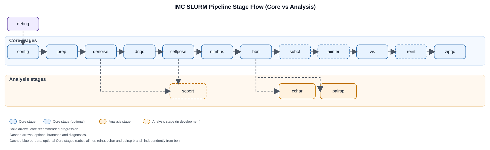

# Pipeline

The preferred interface is the lightweight, project-aware [`sbt` CLI](cli.md).
It initializes or adopts projects, validates configured assets, plans workflows,
submits the existing stage-specific SLURM wrappers, records runs, and inspects
status and logs. The older `pl` command remains available for compatibility.

Start with the [CLI and project guide](cli.md) and the [workflow and run
order](workflow.md), then use the generated [SLURM stage
reference](stages/index.md) for exact inputs, outputs, environments, and config
sections.



```{toctree}
:maxdepth: 1

cli
workflow
stages/index
subclustering
python_stages
bash_helpers
```
